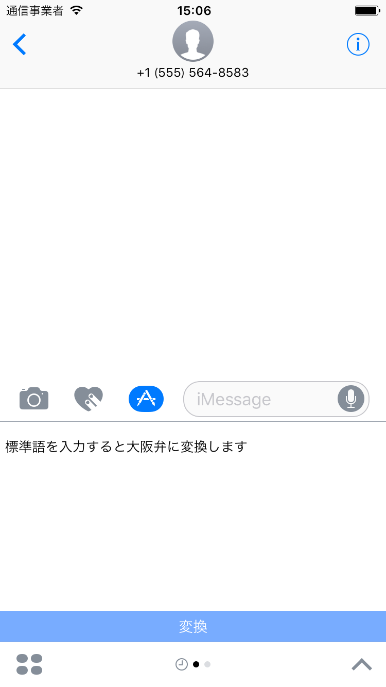
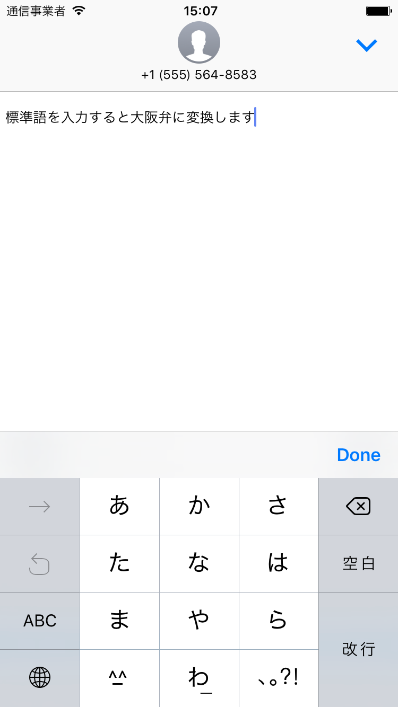
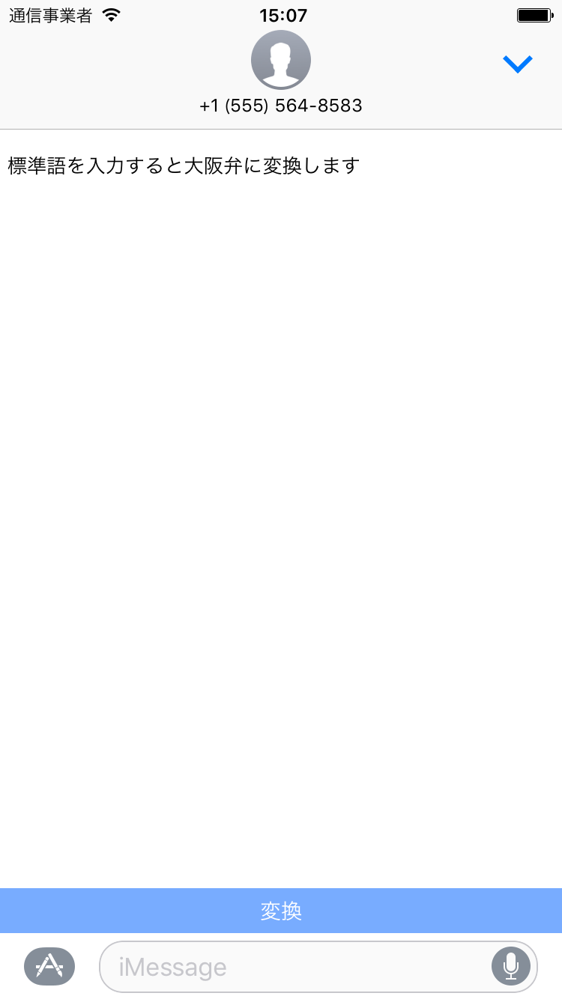
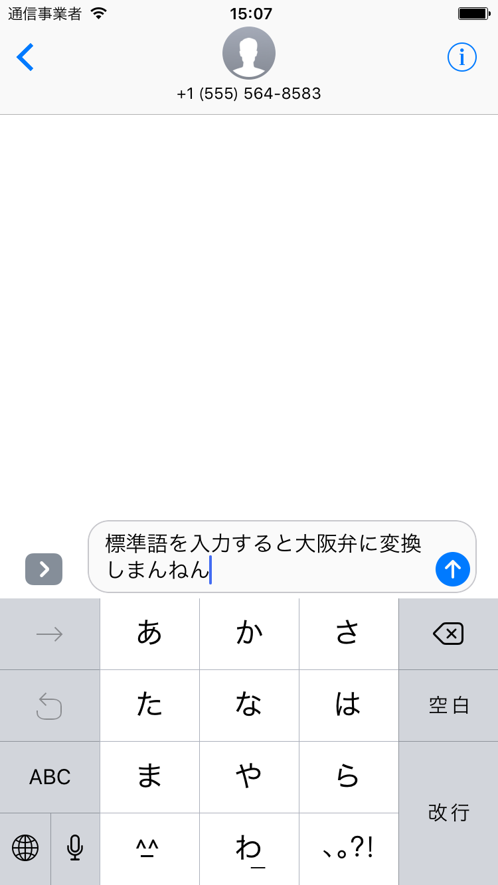
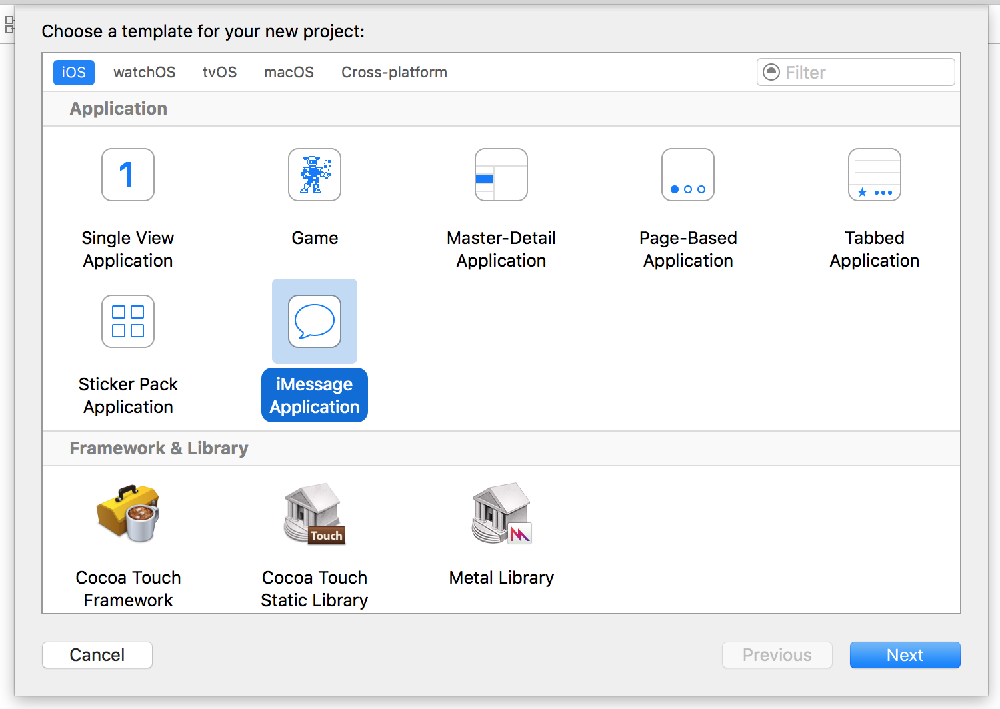
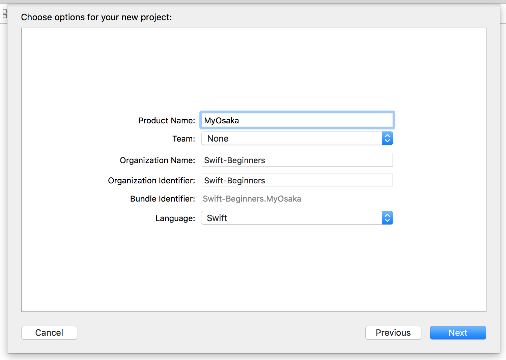

# ●1-1-1　プロジェクトを作成しよう

★★学習のポイント  
**▲このレッスンで学ぶこと**  

iMessageアプリの完成イメージを確認します。文章を入力し変換ボタン押すと大阪弁風に変換されます。  
変換された文章は、iMessageの文章入力エリア挿入されます。  
プロジェクトの作成を行います。

**▲できるようになること**  

これから作るアプリの処理イメージできるようになります。  
iMessageアプリのプロジェクト作成方法を理解できるようになります。  

## ▲iMessageアプリとは
この章では、MessagesViewControllerクラスを用いて、iMessageアプリを作成します。  
iMessageアプリを選択されますと前回入力した文章が表示されます。  
文章のエリアをタップすると文章入力中画面に移ります。  
文章が入力終了するとキーボード上部にある「Done」ボタンをタップすると文章入力終了画面となります。  
「変換」ボタンをタップすると大阪弁に変換された文章がメッセージとして挿入されます。  
ここではTextViewにより文章入力方法、大阪弁に変換するための置換処理と、メッセージ挿入について学びます。  

◎マップアプリの完成イメージ  

|アプリ起動|文章入力中|文章入力終了|メッセージ挿入|
|---|---|---|---|
|||||

## ▲プロジェクトを作成しよう

Xcodeを起動して、プロジェクトを作成します。  
［iMessage Application］を選択してください。  

［Project Name］には、「MyOsaka」と入力しましょう。  
プロジェクトの作成方法がわからない場合は、「1日目 Lesson2-4 Xcodeを起動して、プロジェクトを
作成しよう」（本書P.19）を確認してください。

