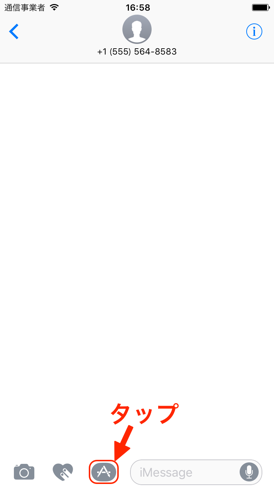
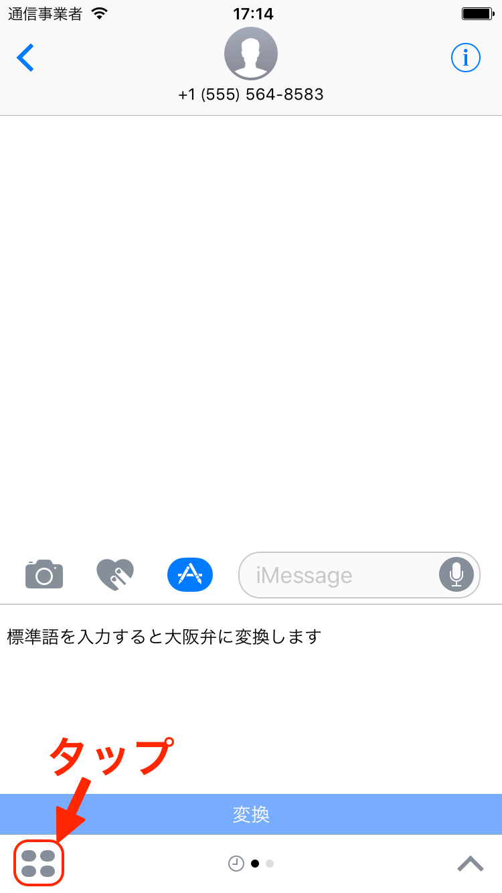
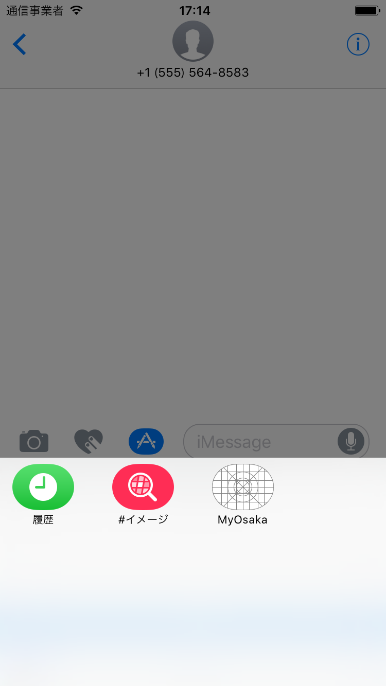
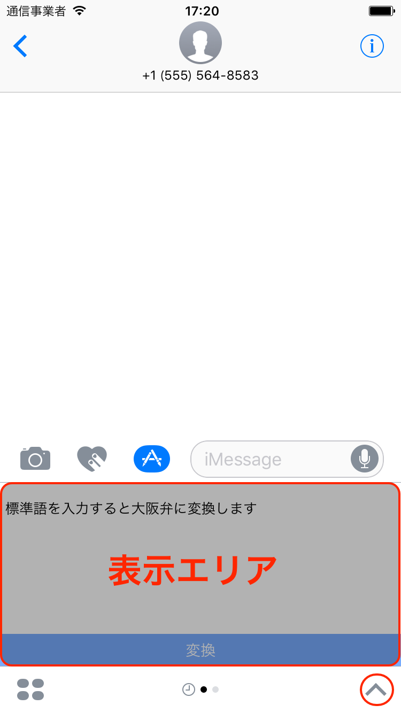

# ●1-1-2　iMessageアプリの仕組みについて理解しよう

★★学習のポイント  
**▲このレッスンで学ぶこと**  

iMessageアプリ基本的な画面遷移方法について学習します。

**▲できるようになること**  

iOSアプリとiMessageアプリの違いについて理解できるようになります。  

## ▲iMessageアプリの起動方法を学ぼう

iMessageアプリはメッセージアプリ内でアプリを起動します。  
メッセージスレッドを開きます。  

をタップします。最後に起動したiMessageアプリが起動します。  
左右にフリック操作するとiMessageアプリを切り替えることができます。  
  

をタップします。インストールされているiMessageアプリ一覧が表示されます。  
タップすると選択されたiMessageアプリが起動します。  

## ▲画面サイズについて学ぼう

|Compact|Expanded|
|---|---|
|||

iMessageのアプリの画面サイズが２種類存在します。  
画面サイズを変更するとiMessageアプリの表示できる画面サイズが変化します。  
画面サイズが小さい方を「Compact」、大きい方を「Expanded」と呼びます。  
また、「Expanded」の時だけ文字入力ができます。  

それぞれ画面の、をタップすると画面サイズを切り替えることができます。  

