# ●1-1-3　画面を作成しよう
★★学習のポイント  
**▲このレッスンで学ぶこと**  

文字入力するText Viewの配置、変換ボタンを配置、AutoLayoutや関連付けについて学びます。  

**▲できるようになること**  

アプリの完成イメージ持ちながらUIパーツの配置ができるようになります。  

## ▲不要なUIパーツを削除しよう

#### ○(1)　MainInterface.storyboardを選択します

◎MainInterface.storyboard選択操作画面  

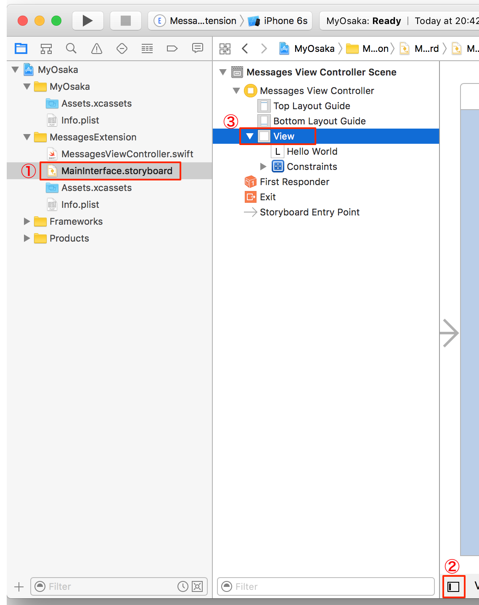

①MainInterface.storyboardを選択します。  
②もし、［Document Outline］が表示されていないときは、 ［Document Outline］ボタンをクリックします。［Document Outline］で、［Message View Controller Scene］ →［Message View Controller］と▼をクリックしてツリーを展開します。  
③［View］を選択します。  

#### ○(2)　「Hello World」ラベルを削除します

◎「Hello World」ラベルを削除する操作画面  
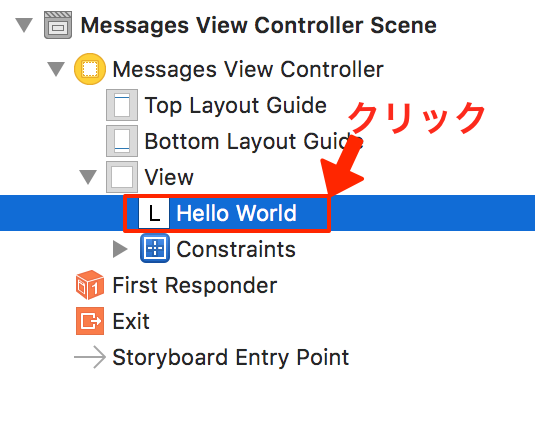

本章では不要なUIパーツなので削除をします。  
［Document Outline］から「Hello World」を選択します。  
「delete」キーを押して削除します。  

## ▲Text Viewを配置しよう

#### ○(1)　Text Viewとは

◎Text View  
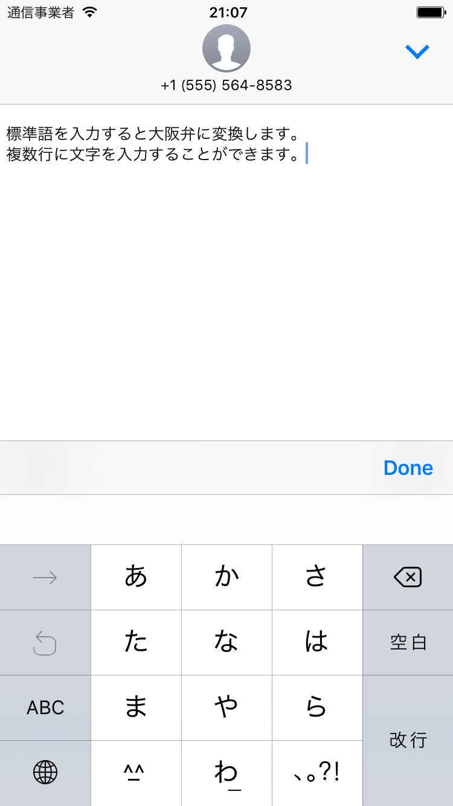

複数行にわたって文字入力するときによく使うパーツです。  
本章では、大阪弁に変換する前の文章を入力するために利用します。  

#### ○(2)　Text Viewを配置します

◎Text View追加操作画面  

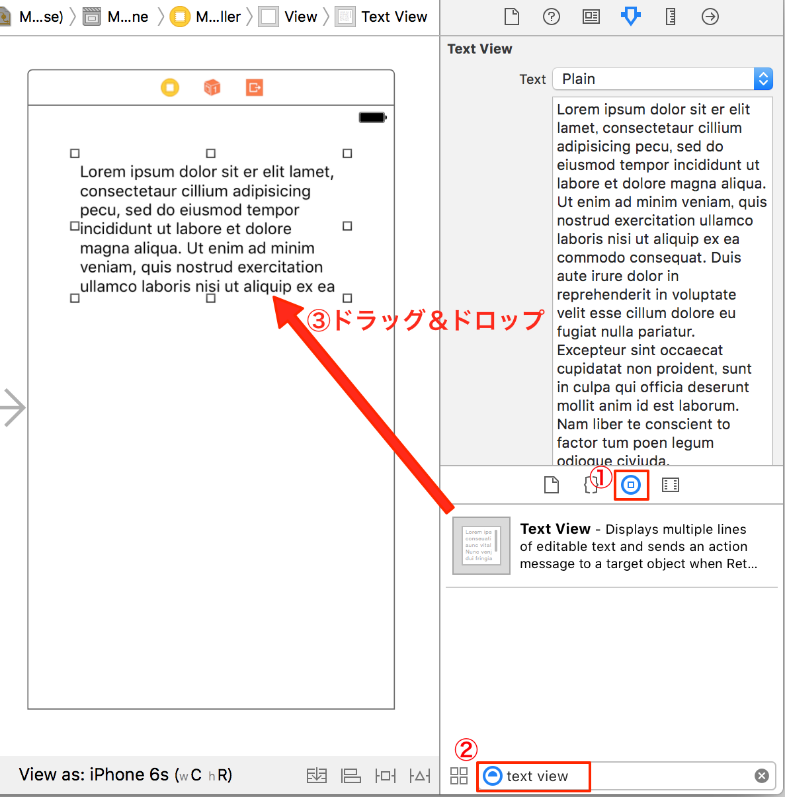

①［Object Library］を選択してください。  

②検索窓に「text view」と入力するとText Viewが表示されます。  
③表示されたText Viewを、Storyboardの上部へドラッグ＆ドロップします。  

## ▲変換ボタンを配置しよう

#### ○(1)　Buttonを配置します

◎Button追加操作画面  

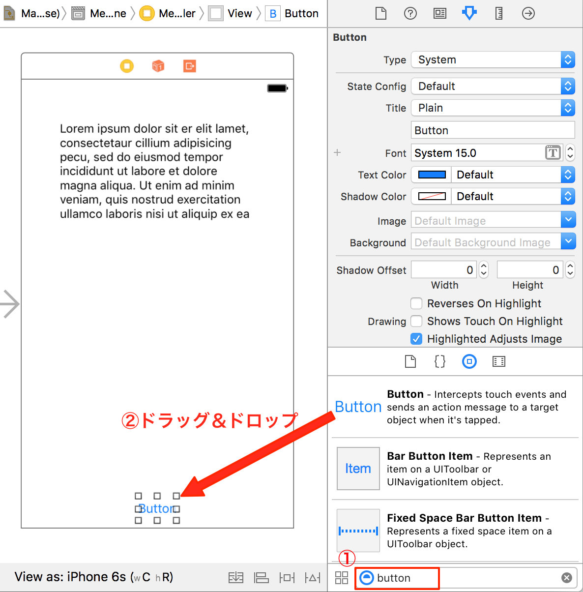

①検索窓に「button」と入力するとText Viewが表示されます。  
②表示されたButtonを、Storyboardの下部へドラッグ＆ドロップします。  

#### ○(2)　タイトルを設定します

◎タイトル設定操作画面  

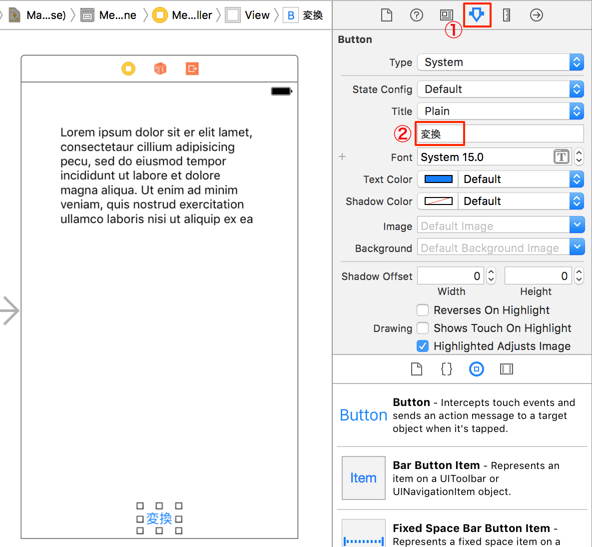

ボタンのタイトルをデフォルトの「Button」から「変換」に変更します。  
①［Attributes inspector］を選択してください。  
②［Titile］に「変換」と入力します。

#### ○(3)　配色を変更します

◎配色変更操作画面１  

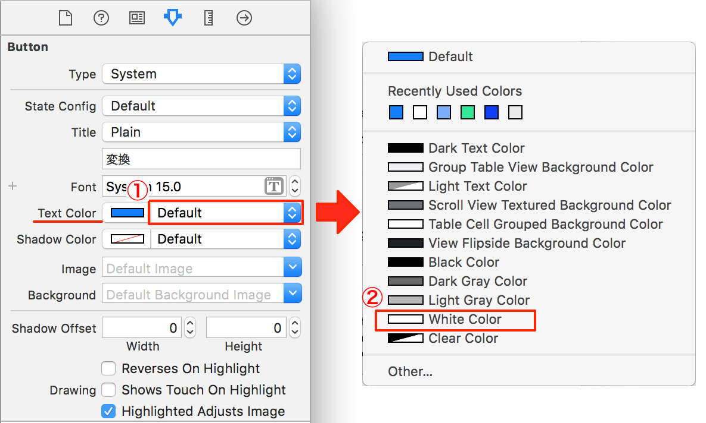

まずは、ボタンのタイトル色を変更します。  
①［Text Color］の「Default」を選択してください。  
②ポップアップした一覧より「White Color」を選択してください。  

◎配色変更操作画面２  

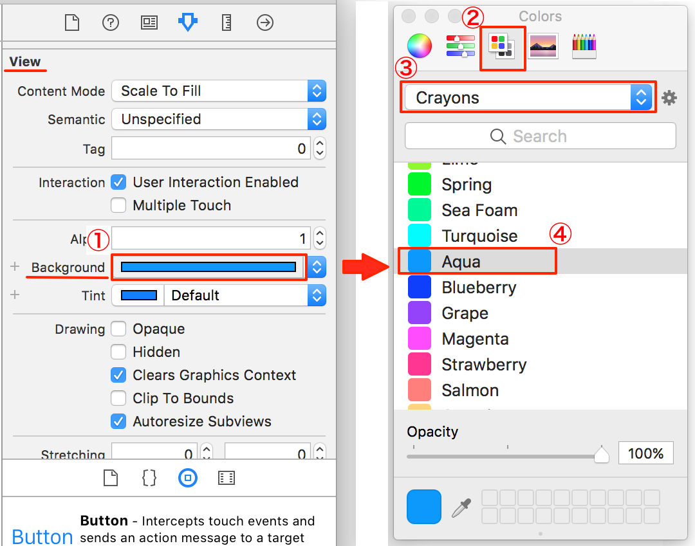

次に、ボタンの背景色を変更します。  
①［View］→［Background］横の選択色部分を選択します。  
②［Color Palettes］タブを選択します。  
③リストより「Crayons」を選択します。  
④最後に「Aqua」を選択します。  

## ▲AutoLayoutで、レイアウトを整えよう

AutoLayoutとは、画面の大きさに合わせて、配置したUIパーツを自動にレイアウトする機能です。  

#### ○(1)　変換ボタンのレイアウトを整えよう

◎変換ボタン AutoLayout設定操作画面  

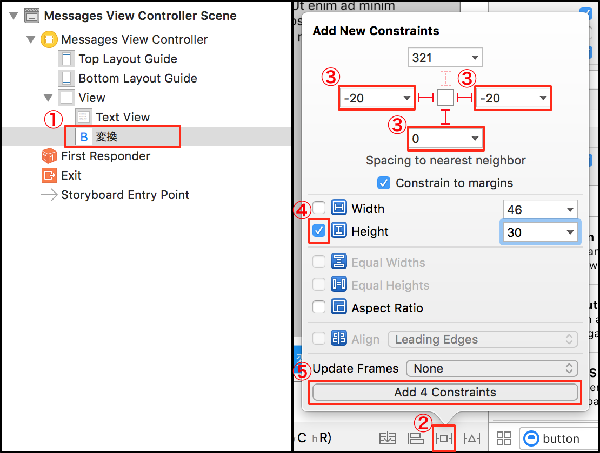

変換ボタンは、画面の下部に横幅いっぱいに配置します。  

①［Document Outline］の［変換］を選択します。  
②
［Pin］をクリックします。  
［Pin］では、UIパーツのサイズや、他のUIパーツとの距離を設定できます。  
［Add New Constraints］というメニューが表示されます。  
③［左余白］を「-20」に、［右余白］を「-20」に、［下余白］を「0」と入力します。  
④［Height］をチェック入れて、「30」と入力します。  
⑤［Add 4 Constraints］を選択して、制約を追加します。

#### ○(2)　Text Viewのレイアウトを整えよう

◎Text View AutoLayout設定操作画面  

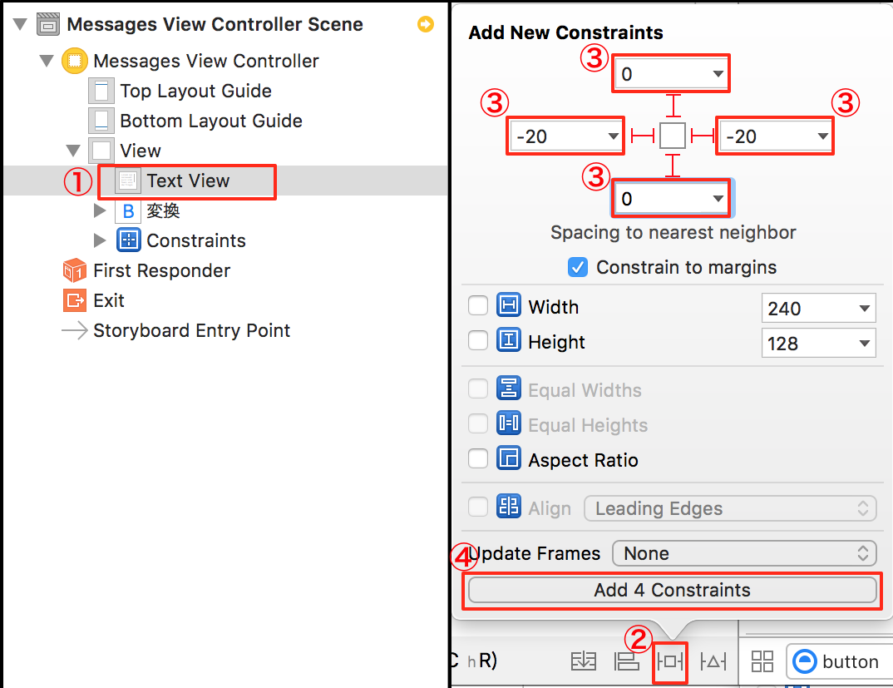

①［Document Outline］の［Text View］を選択します。  
②
［Pin］をクリックします。  
③［上余白］を「0」に、［左余白］を「-20」に、［右余白］を「-20」に、［下余白］を「0」と入力します。  
④［Add 4 Constraints］を選択して、制約を追加します。

◎AutoLayout制約反映操作画面１  

  

画面のようにが表示されていたら［Pin］の設定結果と、表示中のレイアウトに差異があります。  
を選択します。

◎AutoLayout制約反映操作画面２  

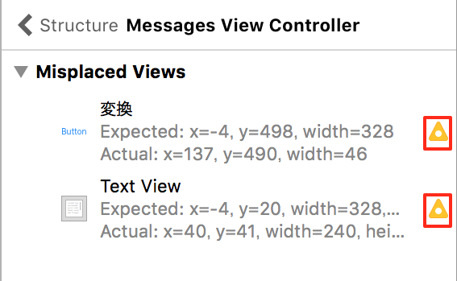  

を選択します。

◎AutoLayout制約反映操作画面３  

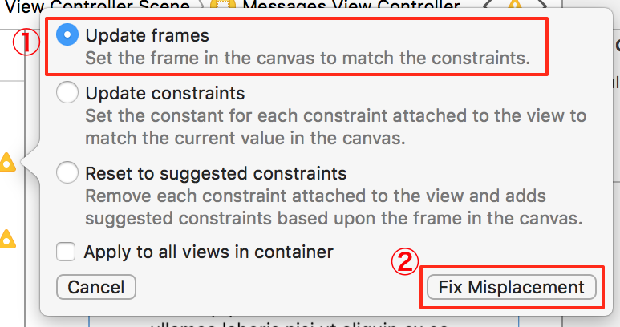  

①Update framesを選択します。  
②Fix Misplacementを選択します。  
がなくなるまで繰り返します。  

## ▲関連付けをしよう

#### ○(1)　IBOutlet接続をしよう

◎Assistant Editor切り替え操作画面  

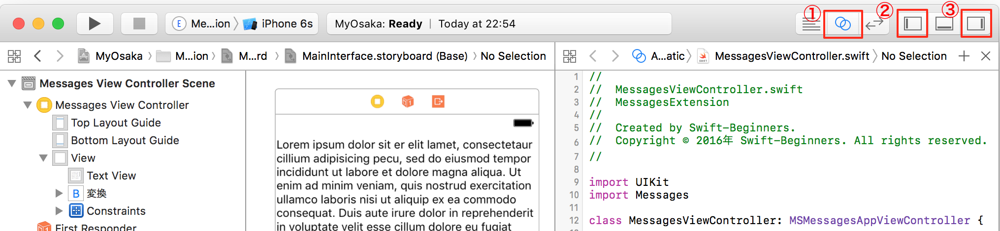  

①［Assistant Editor］ボタンをクリックして、エディタを表示します。  
②［Navigator］ボタンをクリックして［Navigator］を閉じます。  
③［Utilities］ボタンをクリックして［Utilities］を閉じます。  

ここから、関連付けを行います。  

◎Text View関連付け操作画面１  

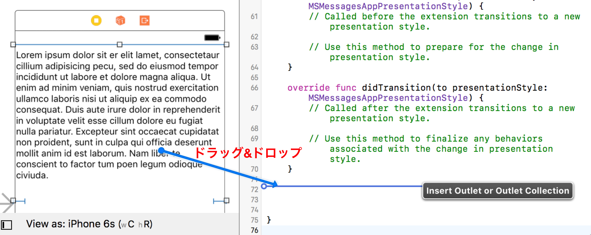  

［Text View］を選択して、 ［control］キー を押しながら、右側のコードにドラック＆ドロップします。  
表示される線を、最後の`}`の上までドラッグ＆ドロップします。  

◎Text Field関連付け操作画面２  

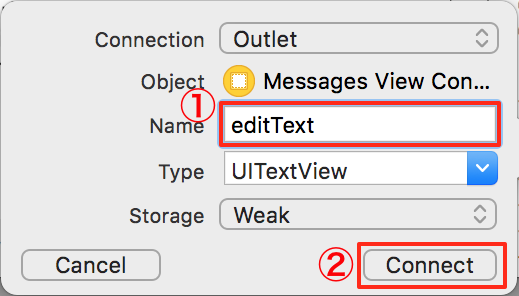  

画面のようなポップアップが表示されます。  
①［Name］を「editText」と入力します。  
②［Connect］を選択します。  

#### ○(2)　IBAction接続をしよう

◎変換ボタン関連付け操作画面１  

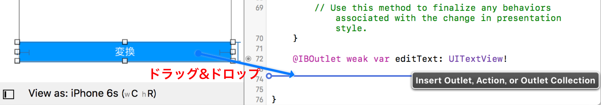  

変換ボタンを選択して、 ［control］キー を押しながら、右側のコードにドラック＆ドロップします。  

◎変換ボタン関連付け操作画面２  

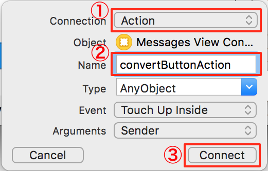  

画面のようなポップアップが表示されます。  
①［Connection］を「Action」を選択します。  
②［Name］を「convertButtonAction」と入力します。  
③［Connect］を選択します。  

以上で、この章は完了です。  
