# ●1-1-4　大阪弁風に変換しよう
★★学習のポイント  
**▲このレッスンで学ぶこと**  

Text Viewを使って文章入力を行います。  
キーボードをカスタマイズし上部に「Done」ボタンを追加します。  
変換ボタンで大阪弁に変換し、メッセージアプリの文字入力エリアに挿入します。  
また、画面サイズが「Compact」ときには文字入力ができないので「Expanded」にプログラムから変化もします。  

**▲できるようになること**  

Text Viewにはどのようなdelegateメソッドがあるのかが理解できるようになります。  
大阪弁変換辞書ファイルの読み込み方、文字列の置換の方法を理解できるようになります。  
また、iMessageアプリ特有の画面サイズの考慮についても理解できるようになります。  

## ▲大阪弁変換辞書ファイルを取り込もう

#### ○(1)　プロジェクトナビゲータを表示します

◎Standard Editor切り替え操作画面  

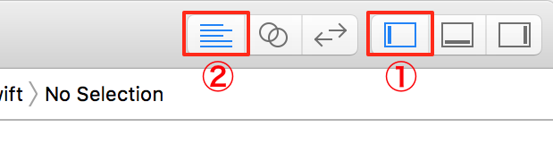  

①［Navigator］ボタンをクリックして［Navigator］を開きます。  
②［Standard Editor］ボタンをクリックして、エディタを表示します。  

#### ○(2)　辞書データを取り込みます

◎osaka.txt取り込み画面１  
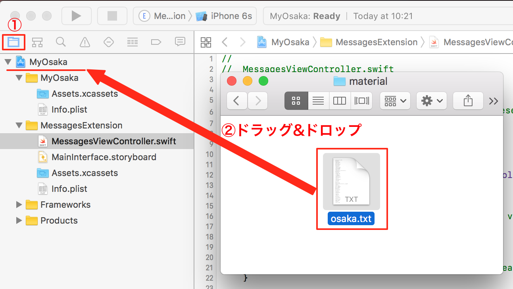  

①［Project navigator］ボタンをクリックして［Project navigator］を表示します。  
②素材フォルダ「MyOsaka/material/」から「osaka.txt」を「My Osaka」プロジェクトの下にドラッグ＆ドロップします。   

◎osaka.txt取り込み画面２  
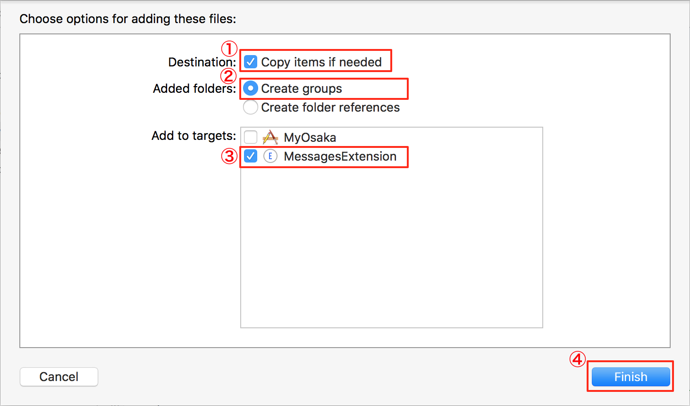  

ダイアログが表示されます。  
①［Copy items if needed］にチェックを付けます。  
このプロジェクトフォルダに辞書データファイルをコピーできます。  
②［Added folders］は「Create groups」を選択します。  
③［Added targets］に「MessagesExtension」にチェックが付いているか確認します。チェックが付いていない場合はチェックを付けます。  
④［Finish］を選択します。  

◎osaka.txt取り込み画面３  
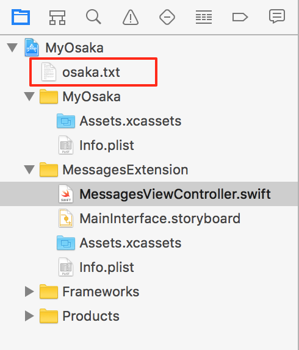  

［Project navigator］に「osaka.txt」が追加されたことが確認できます。  
取り込み完了です。  


★★こちらからダウンロードするのをどうするか？  
http://www.geocities.co.jp/HeartLand/2795/soft/osakaexe.html  


## ▲Text Viewを使ってみよう

Text Viewを使うと複数行の文字入力をすることができます。  
delegate(デリゲート)を通して編集の可否を判定することなどができます。  

#### ○(1)MessagesViewController.swiftを選択します　

◎MessagesViewController.swift選択操作画面  

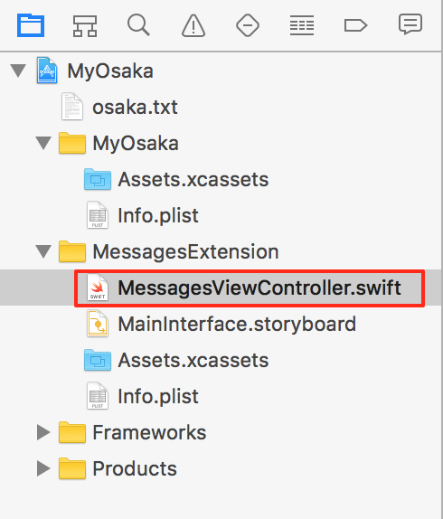  

［Project navigator］から［MessagesViewController.swift］を選択します。

#### ○(2)delegate宣言　

◎delegate宣言及びdelegate通知先設定のソースコード  

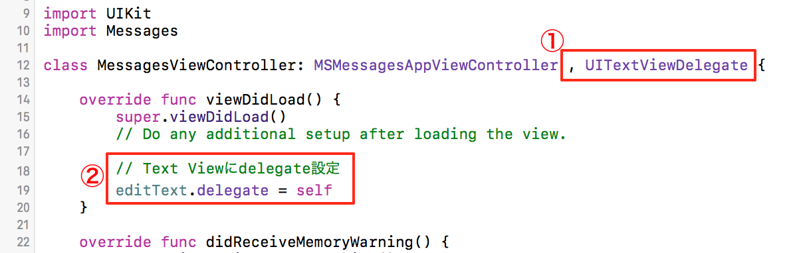  

Text Viewの編集の可否の判定をするためにdelegateを設定します。

①「class MessagesViewController: MSMessagesAppViewController」のあとに「, UITextViewDelegate」を追加します。これによりText Viewのdelegate 機能を使うことを宣言します。

②viewDidLoad() 内に「editText.delegate = self」を追記し、画面表示前にText Viewのdelegate 通知先を設定します。  
　viewDidLoad()は、はじめて画面が表示されるタイミングで実行されるメソッドです。

delegateに関しては、本書「1日目 Lesson5-3 マップ検索アプリを作っていこう」（P.175）の説明も確認してください。  

 Text Viewで通知される代表的なdelegateメソッドは、次の表を参照してください。  

◎Text Viewで利用される代表的なdelegateメソッド一覧表  

|メソッド|タイミング|
|---|---|
|func textViewShouldBeginEditing(UITextView)|編集開始する直前で呼び出される。 falseを戻り値にすると編集が開始されない。|
|func textViewShouldEndEditing(UITextView)|編集終了する直前で呼び出される。 falseを戻り値にすると編集が継続する。 |
|func textView(UITextView, shouldChangeTextIn: NSRange, replacementText: String)|テキスト入力されると呼び出される。  文字数に制限があるときにfalseを戻り値にすると入力ができなくなる。  ただし日本語入力の場合漢字変換前に呼び出されるので要注意|
|func textViewDidChange(UITextView)|文字入力や削除などの編集が行われたら呼び出される|

#### ○(3)　Text Viewの編集可能な画面サイズを「Expanded」だけに制限します  

iMessageアプリで文字入力できるのは画面サイズが「Expanded」時だけと決められています。  
まずは、delegateメソッドを用いて編集可否の判定を追加しましょう。  

◎Text Viewの編集可否を判定するソースコード  

  

Text Viewのエリアをタップすると、delegateによって`func textViewShouldBeginEditing(_ textView: UITextView) -> Bool`メソッドが実行されます。  
メソッド内で編集の可否判断を行います。  
処理をステップごとにどんなことをしているか確認していきましょう。  

```
// 戻り値の変数を用意。初期値はtrue(編集可能)
var is_edit : Bool = true
```
編集可否の判断結果を戻り値とするための変数`is_edit`を定義しています。初期値としてtrue(編集可能)を設定しています。   

```
// 起動時に.compactの場合
if presentationStyle == .compact {
  ・・・・
}
```
画面サイズを判定しています。  
プロパティー`presentationStyle`は現在iMessageアプリが表示されている画面サイズが「Compact」なのか「Expanded」なのかがわかります。  
「Compact」場合は「.compact」、「Expanded」場合は、「.expanded」が取得できます。  
if文分岐条件として「Compact」場合 `{}`内が実行されます。  

 `{}`内の処理を確認しましょう。  
 
```
// false(編集不可)にする
is_edit = false
```
編集可否の判断結果を戻り値とするための変数`is_edit`にfalse(編集不可)を設定しています。


```
return is_edit
```
最後に編集可否を戻り値として設定しています。  

これにより画面サイズが「Compact」ときはText Viewをタップしても編集状態にならなくなります。  
 
|◎実行画面(Comapct)|◎実行画面(Expanded)|
|---|---|
|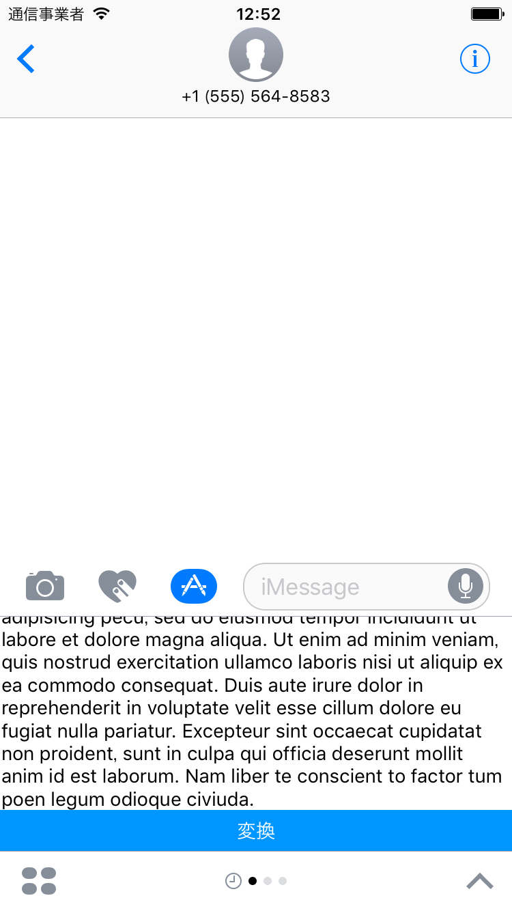|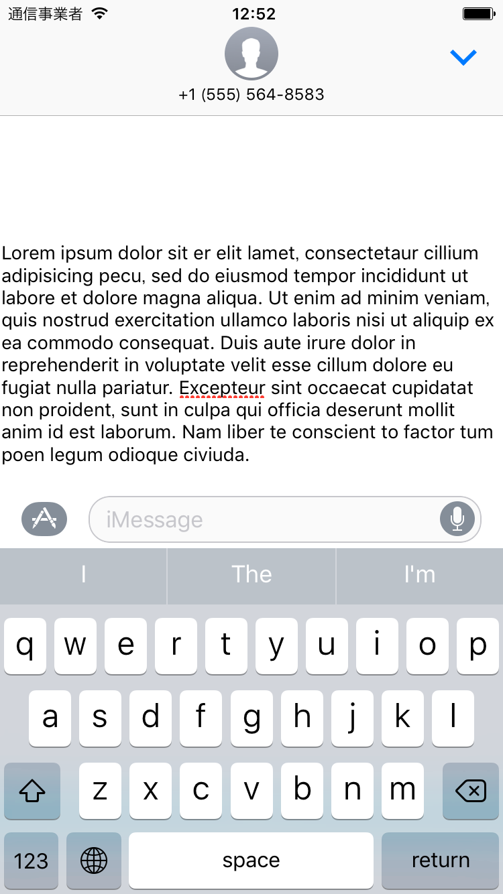|

ここでプログラムを実行して確認してみましょう。  
iMessageアプリを起動します。  
画面サイズが「Comapct」ときにText Viewをタップしてもキーボードが現れず編集状態にならなりません。  
画面サイズを「Expanded」に変更した後、Text Viewをタップしたらキーボードが現れます。編集状態になりました。  

#### ○(4)　Text Viewの編集時のキーボードに「Done」ボタンを追加します  

◎「Done」ボタンのレイアウト図  
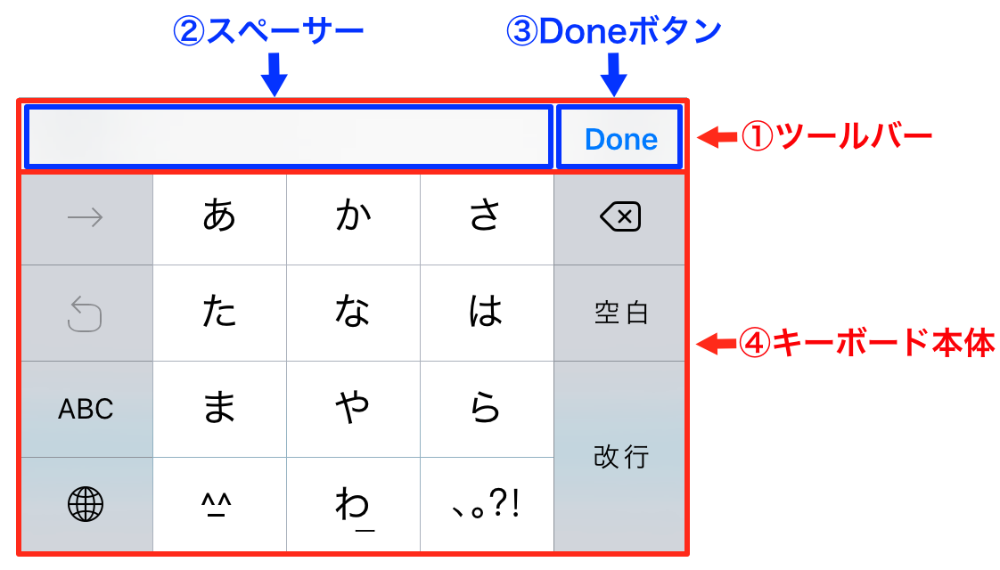  

Text ViewのinputAccessoryViewプロパティを用いてキーボード上部に「Done」ボタンを追加します。  
レイアウト図参考に簡単な流れを確認します。

①ツールバーを作成します。ツールバーは、棒状のパーツで中にボタンなどを追加するための土台としての使うパーツです。  
②スペースバーを作成します。スペースバーは、ツールバー内のパーツごとの余白を調整するためのパーツです。  
③「Done」ボタンを作成します。ボタンはタップすると処理が実行する目的のパーツです。  
ツールバーにスペースバーと「Done」ボタンを設定します。  
④Text Viewの編集時、キーボード上部はinputAccessoryViewプロパティによってパーツを追加することができます。  
inputAccessoryViewプロパティにツールバーを設定します。  

以上のような流れでキーボード上部に「Done」ボタンが表示されるようになります。

StoryboardにUIパーツを配置できないのでコードでUIパーツを生成するため分かりづらいですが少しづつ理解していきましょう。  

◎inputAccessoryViewプロパティに設定するソースコード  
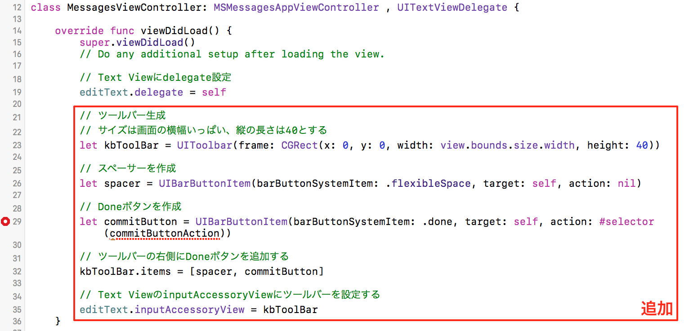  

処理をステップごとにどんなことをしているか確認していきましょう。  

```
// ツールバー生成
// サイズは画面の横幅いっぱい、縦の長さは40とする
let kbToolBar = UIToolbar(frame: CGRect(x: 0, y: 0, width: view.bounds.size.width, height: 40))
```
ツールバーのインスタンスを生成しています。  
［UIToolbar］の引数［frame］に左上の原点と幅高さを指定します。  
引数「frame」はCGRect型なので［CGRect］メソッドでCGRect型の値を生成します。  
inputAccessoryViewプロパティに設定するとキーボード上部にUIパーツが挿入されますので、原点は(0,0)となり、幅は画面の横幅と同じ、高さは40とします。  
画面サイズの横幅は`view.bounds.size.width`とすると取得することができます。  

```
// スペーサーを作成
let spacer = UIBarButtonItem(barButtonSystemItem: .flexibleSpace, target: self, action: nil)
```
ツールバー用ボタン［UIBarButtonItem］のインスタンスを生成しています。  
ここではスペーサーとして利用し、ツールバー上でUIパーツ同士の余白を調整するために利用します。  
本章では、「Done」ボタンを右側によせるために利用します。  
［UIBarButtonItem］の引数［barButtonSystemItem］に「.flexibleSpace」を指定すると余白として機能します。  

```
// Doneボタンを作成
let commitButton = UIBarButtonItem(barButtonSystemItem: .done, target: self, action: #selector(commitButtonAction))
```
ツールバー用ボタン［UIBarButtonItem］のインスタンスを生成しています。  
「Done」ボタンを作成するために利用します。  
引数［barButtonSystemItem］に「.done」を指定すると自動的にボタンタイトルが「Done」に設定されます。  
日本語化するとボタンタイトルが「完了」に変化します。日本語化の手順については本書「1日目 Lesson5-3 マップ検索アプリを作っていこう」（P.185）を確認してください。  
引数［target］に次の引数［action］に指定するメソッドが存在するクラスを指定します。本章では同じSwiftファイル内にメソッドを作成するので「self」とします。  
次の引数［action］にはタップされたときに呼び出すメソッド「commitButtonAction」を指定します。  
「#selector(commitButtonAction)」と記述しますがここでは記述の方法だけ覚えれば大丈夫です。  

ここまで入力するとが表示されます。これは「commitButtonAction」メソッドが存在しないためです。  
先で「commitButtonAction」メソッドを作成しますのでここではとなったままで大丈夫です。  

```
// ツールバーの右側にDoneボタンを追加する
kbToolBar.items = [spacer, commitButton]
```
ツールバーのitemsプロパティーに先ほど生成したスペーサーと「Done」ボタンを設定します。  
ツールバーのボタンは複数存在することが多いので配列で設定します。  
配列は「［ <値1>,<値2>,...］」という形式で記述します。  

```
// Text ViewのinputAccessoryViewにツールバーを設定する
editText.inputAccessoryView = kbToolBar
```
Text ViewのinputAccessoryViewプロパティーにツールバーを設定します。  
これでText Viewが編集状態になりキーボードが現れるとツールーバーが表示され、その中に「Done」ボタンが表示されるようになります。  

#### ○(5)　キーボードの「Done」ボタンがタップされたときの処理を追加します  

◎「Done」ボタンがタップされたときのソースコード  
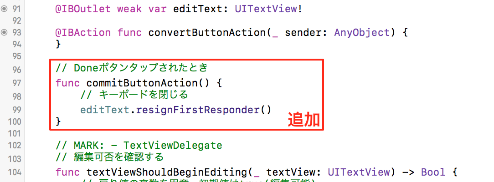  

ツールバーに「Done」ボタンを作成するときにタップしたとき実行するように設定をしました。  
「Done」ボタンがタップされたときに実行されるメソッドです。  
処理をステップごとにどんなことをしているか確認していきましょう。  

```
// キーボードを閉じる
editText.resignFirstResponder()
```
Text Viewで編集中のキーボードを閉じる処理を実行しています。  
これでText Viewの編集が終了します。  

|◎実行画面(編集中)|◎実行画面(編集終了)|
|---|---|
|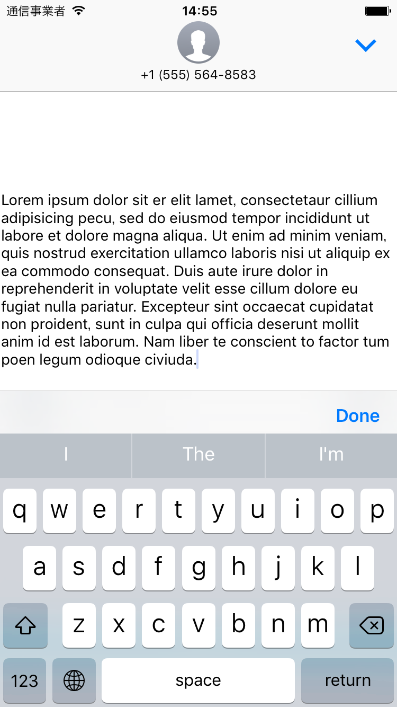|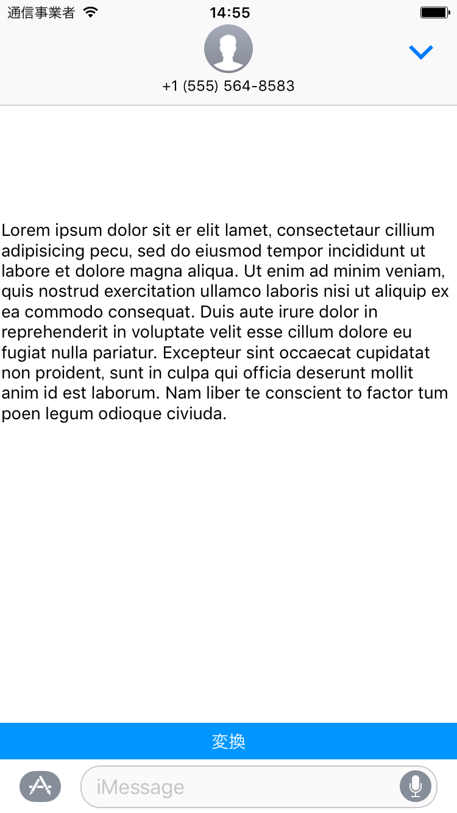|

ここでプログラムを実行して確認してみましょう。  
画面サイズを「Expanded」に変更した後、Text Viewをタップしたらキーボードが現れます。  
このときにキーボード上部に「Done」ボタンが現れます。  
「Done」ボタンをタップするとキーボードが閉じることができます。  

## ▲メッセージを挿入してみよう

◎「変換」ボタンが押されたらメッセージを挿入するソースコード  
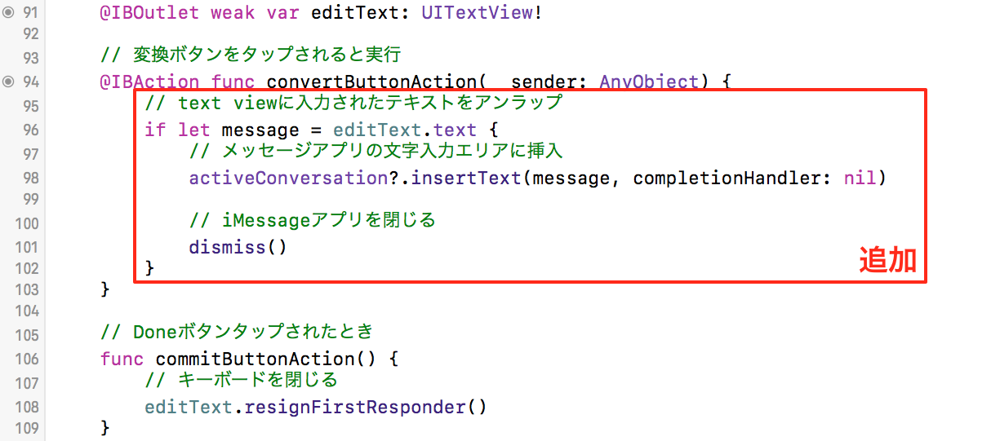  

メッセージアプリの文字入力エリアにText Viewで編集した文字列を挿入する方法を学習します。  
処理をステップごとにどんなことをしているか確認していきましょう。  

```
// text viewに入力されたテキストをアンラップ
if let message = editText.text {
  ・・・
}
```
Text View［editText］の［text］プロパティーに入力された文字列が格納されています。［text］プロパティーは、オプショナル型です。  
「if let〜」を使うことによって値があるときだけif分岐内が実行され変数「message」値が取り出されます。これをアンラップと呼びます。  


```
// メッセージアプリの文字入力エリアに挿入
activeConversation?.insertText(message, completionHandler: nil)
```
メッセージアプリの文字入力エリアにText Viewで入力された文字列を挿入しています。  
プロパティー［activeConversation］は現在アクティブのメッセージアプリインスタンスを取得できます。  
［insertText］メソッドは、メッセージアプリの文字入力エリアに文字列を挿入します。  
［insertText］メソッドの第１引数は挿入したい文字列を設定します。Text Viewの入力された文字列を設定しています。  
第２引数は挿入完了すると実行されるクロージャーです。今回は無処理なのでnilを設定します。  

```
// iMessageアプリを閉じる
dismiss()
```
iMessageアプリ自体を終了します。  

|◎実行画面(編集中)|◎実行画面(挿入完了)|
|---|---|
|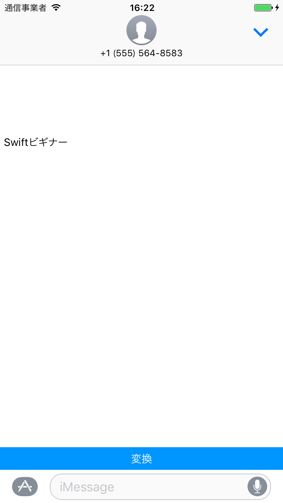|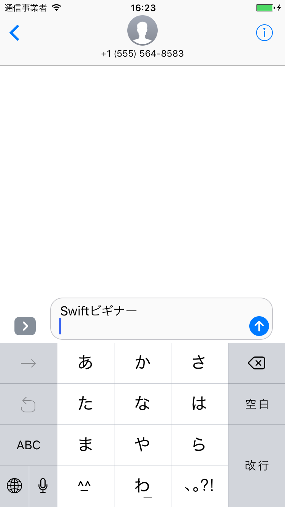|

ここで実行すると「変換」ボタンをタップするとText Viewで入力した文字列がメッセージアプリに挿入されたことを確認できます。  

## ▲大阪弁に変換してみよう  

#### ○(1)　大阪弁変換辞書ファイルの構成を確認します  
◎大阪弁変換辞書ファイル  
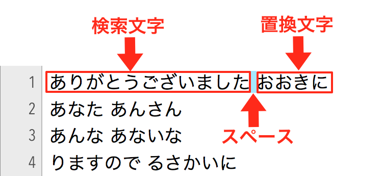  

大阪弁変換辞書ファイルは、１行で検索文字と置換文字がスペースで区切られたファイルになっています。  
変換するにあたり１行読み込みスペースの前後に分解して検索文字と置換文字を取り出しText Viewに入力された文字列を置換する処理を繰り返します。  

#### ○(2)　大阪弁変換処理を追加します  

◎大阪弁変換するソースコード  
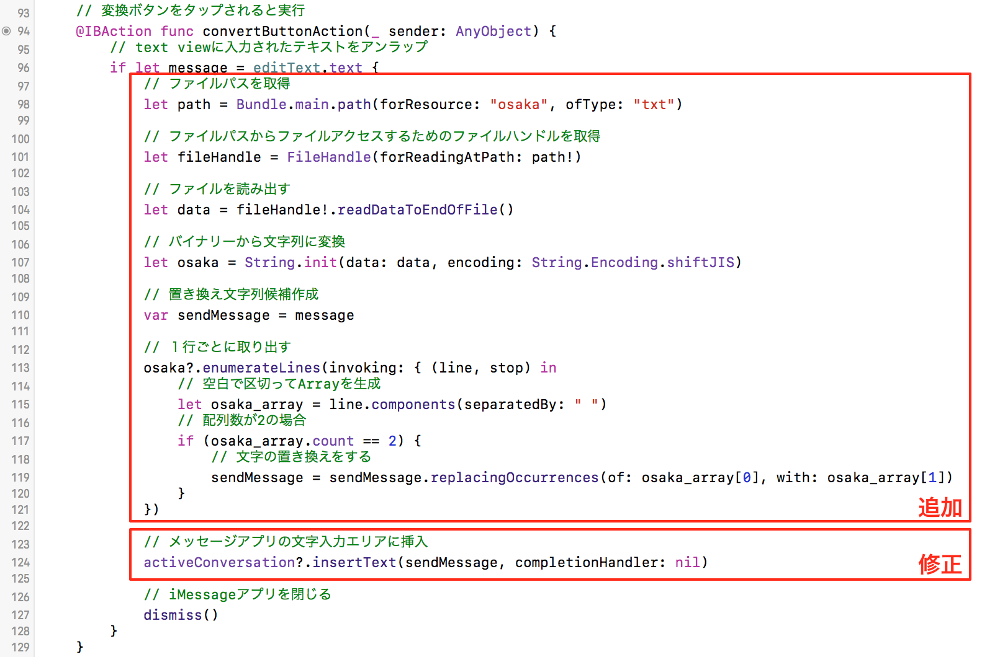  

「変換」ボタンをタップされたソースコードを追加・修正します。  
処理をステップごとにどんなことをしているか確認していきましょう。  

```
// ファイルパスを取得
let path = Bundle.main.path(forResource: "osaka", ofType: "txt")
```
Bundleが、ファイルを管理してくれるクラスです。  
プロジェクトに取り込んだ大阪弁変換辞書ファイル「osaka.txt」のファイル名と拡張子を指定し、ファイルの場所を取得しています。  

```
// ファイルパスからファイルアクセスするためのファイルハンドルを取得
let fileHandle = FileHandle(forReadingAtPath: path!)
```
ファイルの場所から実際にファイルを操作するためのファイルハンドルを取得しています。  
ここではファイルを操作するときにはファイルハンドルを取得するという理解で大丈夫です。  

```
// ファイルを読み出す
let data = fileHandle!.readDataToEndOfFile()
```
ファイル全体を読み込みしています。  
読み込み結果はData型の変数「data」に格納されます。  

```
// バイナリーから文字列に変換
let osaka = String.init(data: data, encoding: String.Encoding.shiftJIS)
```
ファイル読み込み結果のData型をString型に変換をしています。  
大阪弁変換辞書ファイルは、Windowsで一般的なShift-JIS形式のテキストファイルで構成されています。  
ここでは第２引数［encoding］に「String.Encoding.shiftJIS」を指定することによってShift-JIS形式のテキストファイルでもプログラムで識別できるString型に変換することができます。  

```
// 置き換え文字列候補作成
var sendMessage = message
```
Text Viewの［text］プロパティーからアンラップした定数「message」を変数「sendMessage」に代入します。  
これから大阪弁に変換処理を行います。  
このときにText Viewで入力された文字列を１語ずつ徐々に置換します。そのため変数に元の入力された文字列を代入しその代入した結果を置換していきます。  

```
// １行ごとに取り出す
osaka?.enumerateLines(invoking: { (line, stop) in
  ・・・
})
```
大阪弁変換辞書文字列が格納されている定数「osaka」から１行ずつ取り出します。  
１行取り出されるとクロージャーが実行されます。  
引数「line」に取り出された文字列が格納されています。  
次からクロージャー内処理を確認していきます。  

```
// 空白で区切ってArrayを生成
let osaka_array = line.components(separatedBy: " ")
```
１行ごとに取り出された文字列「line」を［components］メソッドを用いて特定文字で区切り配列として文字列を分解します。  
第１引数［separatedBy］に半角スペースを設定することで空白の前後の文字列が分解されて配列「osaka_array」に格納されます。  

```
// 配列数が2の場合
if (osaka_array.count == 2) {
  // 文字の置き換えをする
  sendMessage = sendMessage.replacingOccurrences(of: osaka_array[0], with: osaka_array[1])
}
```
配列「osaka_array」の配列の要素数が２であることをif文分岐でチェックします。これは正しい辞書形式になっていない場合の不具合対策です。  
分岐処理内で変数「sendMessage」に対して［replacingOccurrences］メソッドを実行すると置換することができます。  
第１引数［of］は検索文字列を、第２引数［with］は置換文字列を設定します。  
ここでは配列の添字0が検索文字列、添字1が置換文字列にとして設定します。  
（「(1)　大阪弁変換辞書ファイルの構成を確認します」を参照）

以上のクロージャー内の処理を繰り返すことによって、大阪弁変換辞書の全項目の置換が行われます。  

```
// メッセージアプリの文字入力エリアに挿入
activeConversation?.insertText(sendMessage, completionHandler: nil)
```
メッセージアプリの文字入力エリアに大阪弁に変換された文字列を挿入しています。  
先ほどと第１引数の設定する変数が異なっています。  

|◎実行画面(変換実行前)|◎実行画面(変換実行後)|
|---|---|
|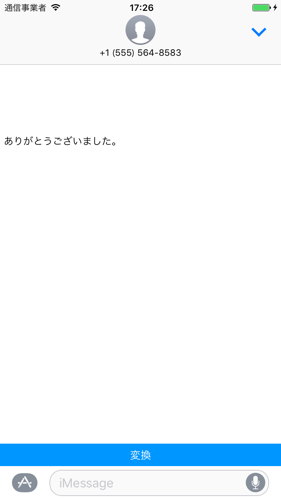||

ここで実行すると「変換」ボタンをタップするとText Viewで入力した文字列が大阪弁に変換されてメッセージアプリに挿入されたことを確認できます。  

## ▲前回入力した内容を記憶しよう  

毎回入力を全て行うのは不便です。  
ここではデータの永続化利用して入力した内容を保持と復元を行うようにしましょう。  
データの永続化に関しては、本書「2日目 Lesson1-3 タイマー画面を作ろう」（P.228）の説明も確認してください。  

#### ○(1)　永続化を保持と復元行うためのキーを定義します  

◎永続化を保持と復元行うためのキーを定義するソースコード  
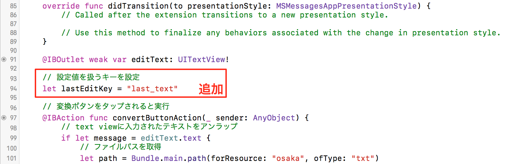  

データの永続化を行うためにキーを用いて保持と復元を行います。  
そのキーについて定義をします。  

#### ○(2)　初期値を設定します  

◎初期値を設定するソースコード  
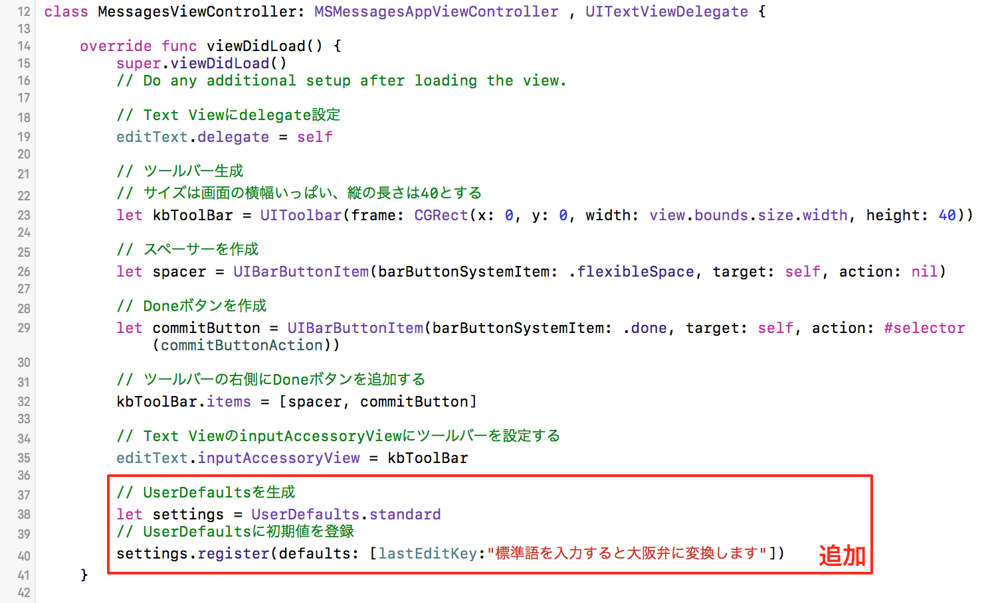  

```
// UserDefaultsを生成
let settings = UserDefaults.standard
// UserDefaultsに初期値を登録
settings.register(defaults: [lastEditKey:"標準語を入力すると大阪弁に変換します"])
```

データの永続化行うためには初期値の登録を行なう必要があります。  
registerメソッドに、キーと値を引数として渡すことで、初期値の登録を行っています。  
本章では、Text Viewの入力した文字列を保持しますので初めてiMessageアプリを起動したときにText Viewに表示される文字列を登録しています。  

#### ○(3)　アプリが非アクティブになったときに入力されている文字列を保持します  

◎文字列を保持するソースコード  
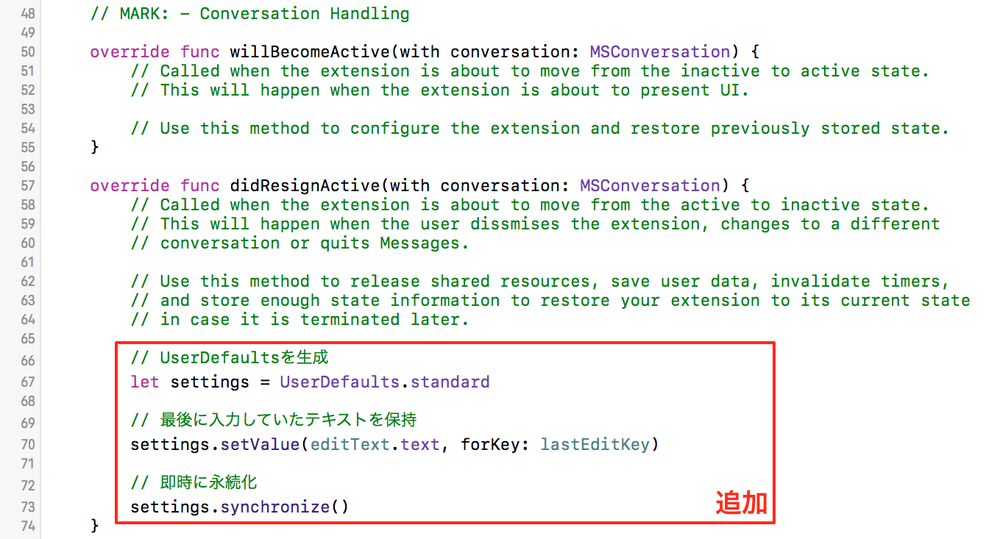  

didResignActive()は、iMessageアプリが画面を閉じたり他のアプリに切り替わりなどが発生し非アクティブなったタイミングで実行されるメソッドです。

```
// UserDefaultsを生成
let settings = UserDefaults.standard
// 最後に入力していたテキストを復元
settings.setValue(editText.text, forKey: lastEditKey)
// 即時に永続化
settings.synchronize()
```

Text Viewの文字列をUserDefaultに保持します。  
setValueメソッドに、キーと値を引数として渡すことで、登録を行っています。  
synchronizeメソッドを実行すると、UserDefaultsはデータを即時に永続化します。  

#### ○(4)　アプリがアクティブになったときに最後に入力された文字列を復元します  

◎文字列を復元するソースコード  
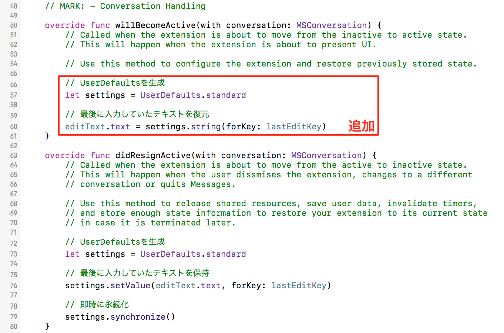  

willBecomeActive()は、iMessageアプリが画面を開いたり他のアプリから切り替わりって起動が発生しアクティブなったタイミングで実行されるメソッドです。

```
// UserDefaultsを生成
let settings = UserDefaults.standard
// 最後に入力していたテキストを復元
editText.text = settings.string(forKey: lastEditKey)
```

Text ViewにUserDefaultで保持していた文字列を復元しています。  
stringメソッドにキーを渡すことで、取得を行なっています。  

## ▲Text Viewを自動で編集状態にしよう  

#### ○(1)　Text Viewをタップしたとき画面サイズが「Compact」だった場合「Expanded」変更します  
◎画面サイズが「Compact」だった場合「Expanded」変更するソースコード  
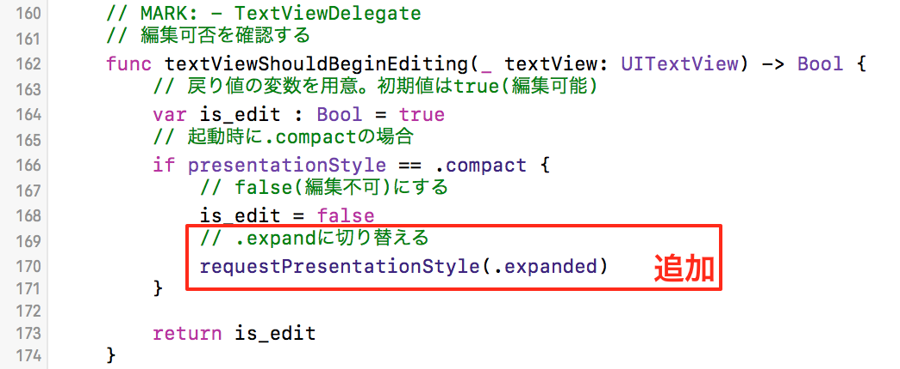  

画面サイズが「Compact」だった場合、Text Viewをタップしても反応しない処理となっていました。画面サイズを自動で「Expanded」変更するように修正をします。  
requestPresentationStyleは引数で指定した画面サイズに変更します。  


#### ○(2)　画面サイズが「Expanded」に変化したらText Viewを自動で編集状態にします  
◎画面サイズが「Expanded」に変化したら編集状態にするソースコード  
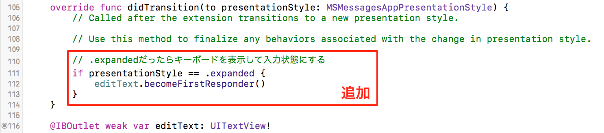  

didTransition()は、画面サイズが変化したタイミングで実行されるメソッドです。

```
// .expandedだったらキーボードを表示して入力状態にする
if presentationStyle == .expanded {
  editText.becomeFirstResponder()
}
```
if文分岐で画面サイズを判断しています。画面サイズが「Expanded」だった場合実行します。  
becomeFirstResponderメソッドは、Text Viewを編集状態にします。  

これで完成です。  
実行して確認してみましょう。  

画面サイズが「Compact」ときにText Viewタップすると画面サイズが「Expanded」に変化します。  
また、画面サイズが「Expanded」に変化したタイミングで編集状態に変化するします。  
編集した文章も永続化により保持されて再起動した時も前回の文章が復元されます。  

|◎実行画面(初回起動)|◎実行画面(タップしたら編集中)|◎実行画面(編集終了)|
|---|---|---|
|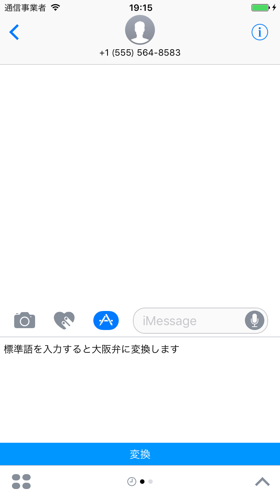|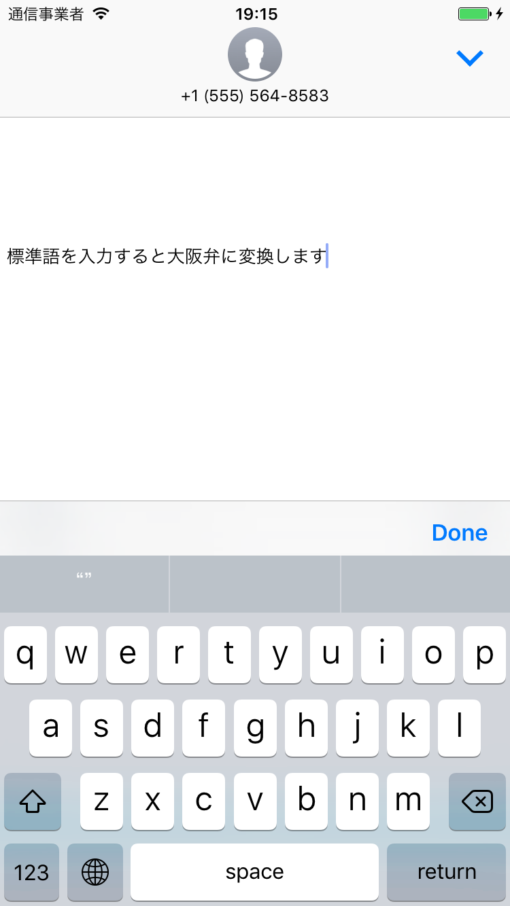|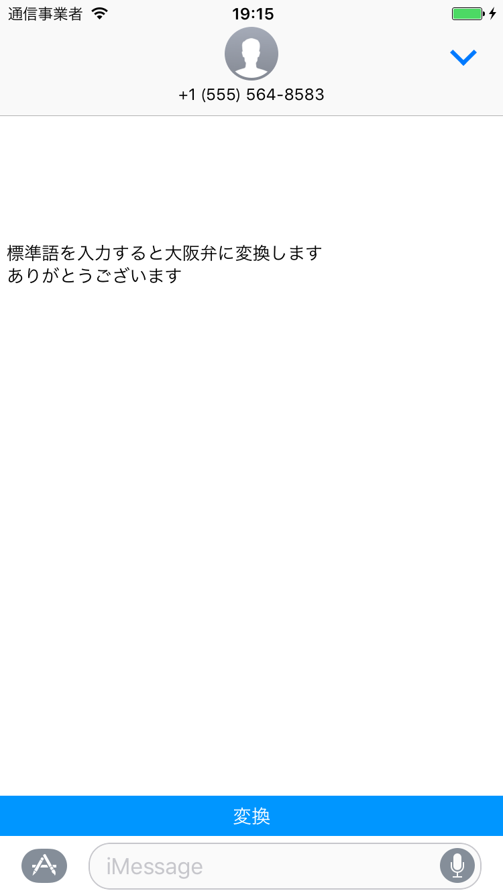|

|◎実行画面(大阪弁変換完了)|◎実行画面(再起動)|
|---|---|
|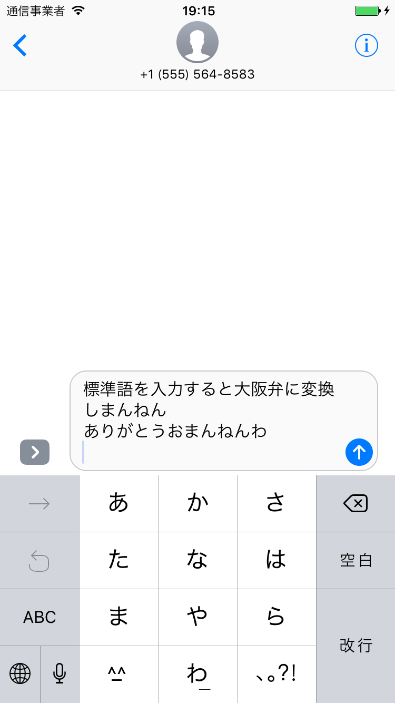|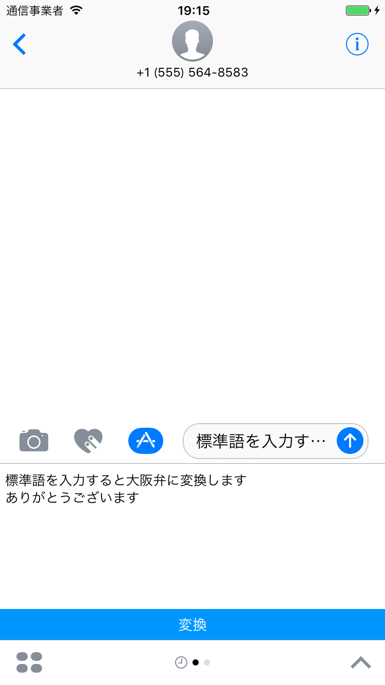|
