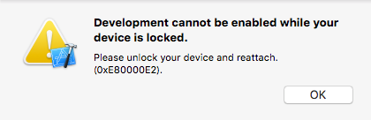
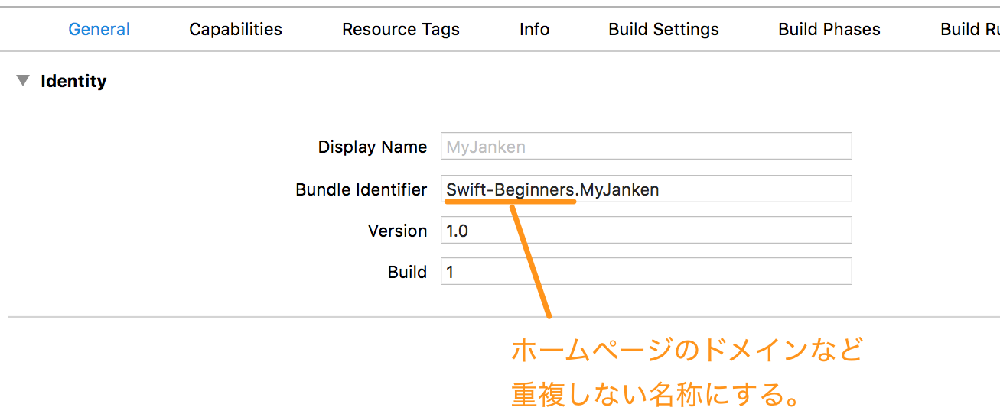

# 転送時に「Build Failed」と表示される。Bundle identifierが重複している場合

## エラーの内容を確認してきます

iPhoneアプリの転送時に「Build Failed」と表示されて、iPhoneへのアプリ転送が失敗する場合には、Bundle identifierが重複している場合があります。
次の手順で確認してみてください。



①［（プロジェクト名）］を選択する  
②［Hide project and targets list］ボタンをクリックします  
③［TARGETS］のプロジェクトを選択  
④［General］を選択  
⑤［Signing］（署名）のグループまでスクロールします  
⑥［Status］のエラーメッセージを確認します  

#### エラーメッセージの内容
```
Failed to create provisioning profile.  
The app ID "Swift-Beginners.MyJanken" cannot be registered to your development team. Change your bundle identifier to a unique string to try again.
```

［Bundle identifier］の登録に失敗している旨のメッセージが掲載されています。  
［Bundle identifier］はAppleが管理しているIDで重複しないように設定する必要があります。  

## ［Bundle identifier］の設定を変更

［Bundle identifier］の項目を確認して、変更していきます。



［Bundle identifier］が、書籍の「Swift-Beginners」のままになっていないか確認してください。まだ、アプリを公開していない開発環境でも［Bundle identifier］は重複しないIDである必要があります。ホームページのドメインなど重複しない名称にする必要があります。
